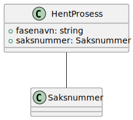
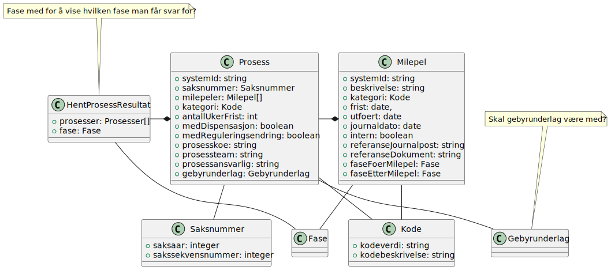
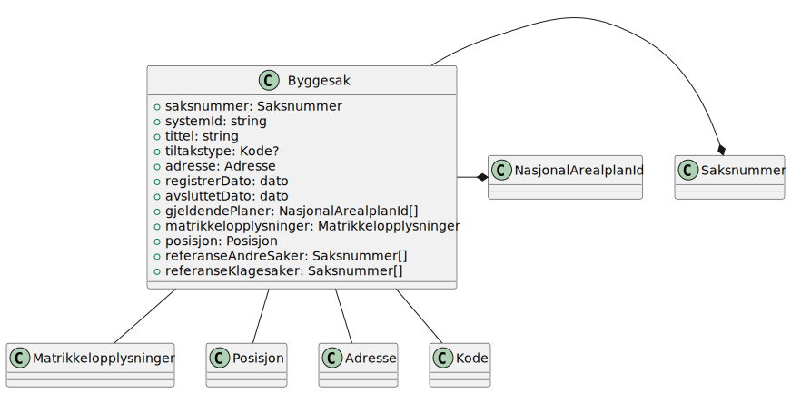
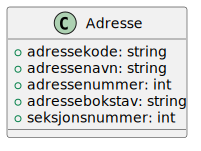
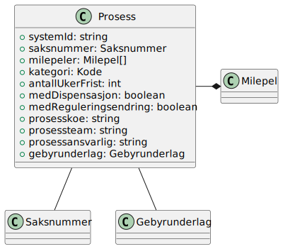

# fiks-saksfaser-specification

_Under arbeid_

### Utgangspunkt
Vi har brukt datamodellene for _prosesser_ fra eByggesak (se diagram 1.5 på side 23) som utgangspunkt
https://www.ks.no/globalassets/fagomrader/digitalisering/verktoykasse-plan--og-byggesaker/verktoy/ebyggesak/vedleggspakke-ebyggesak-v2.1.pdf

### Noen mål for protokollen:

- Man skal kunne se framdriften på en sak
- Man skal kunne se hva som har skjedd på en gitt fase
- Det skal gi nok informasjon til at man skal kunne f.eks. sende inn et innspill fra en innsyns/publiseringsløsning.
- Gi nok informasjon om dokumenter til at man skal kunne hente selve dokumentet via Fiks Arkiv

### Notater fra møtet 04.09.2024

- Det kom et forslag om å heller kalle protokollen for Fiks Saksbehandling. Dette kan vi ta opp neste gang igjen, men foreløpig kaller vi det fortsatt for Saksfaser.
- Vi lager et github repository med forslag til ny protokoll for saksfaser.
Datamodell kan baseres på eByggesak.
- Vi lager json-schemas basert på datamodellen fra eByggesak.
- Protokollen skal støtte kun 2 hent-meldinger. En for hent sak som gir alt for saken, og en for hent prosess som gir alt for den fasen men etterspør.
- Nøkkel for hent vil være saksnummer for hent sak og saksnummer + en identikator for fasen i hent prosess.
- Tjener (tjener part) i protokollen er typisk saksbehandlingssystemer, og klient (klient part) er typisk publiseringssystemer.
T- jener vil kun gi offentlige data, ikke skjermet data.
- Det er viktig at vi får frikoblet faser og milepæler

### Klassediagram

#### Melding - Hent saksfaser

#### Melding - Hent saksfaser resultat

#### Melding - Hent prosess

#### Melding - Hent prosess resultat

#### Byggesak

#### Adresse

#### Prosess

