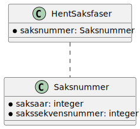
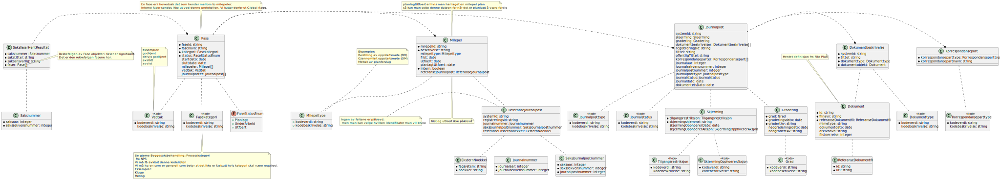
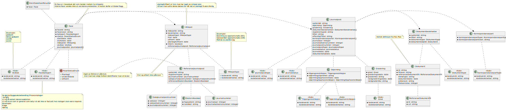

# fiks-saksfaser-specification

_Under arbeid_

### Utgangspunkt
Vi har brukt datamodellene for _prosesser_ fra eByggesak (se diagram 1.5 på side 23) som utgangspunkt
https://www.ks.no/globalassets/fagomrader/digitalisering/verktoykasse-plan--og-byggesaker/verktoy/ebyggesak/vedleggspakke-ebyggesak-v2.1.pdf

### Noen mål for protokollen:

- Man skal kunne se framdriften på en sak
- Man skal kunne se hva som har skjedd på en gitt fase
- Det skal gi nok informasjon til at man skal kunne f.eks. sende inn et innspill fra en innsyns/publiseringsløsning.
- Gi nok informasjon om dokumenter til at man skal kunne hente selve dokumentet via Fiks Arkiv

### Notater 

#### Fra møtet 04.09.2024

- Det kom et forslag om å heller kalle protokollen for Fiks Saksbehandling. Dette kan vi ta opp neste gang igjen, men foreløpig kaller vi det fortsatt for Saksfaser.
- Vi lager et github repository med forslag til ny protokoll for saksfaser.
Datamodell kan baseres på eByggesak.
- Vi lager json-schemas basert på datamodellen fra eByggesak.
- Protokollen skal støtte kun 2 hent-meldinger. En for hent sak som gir alt for saken, og en for hent prosess som gir alt for den fasen men etterspør.
- Nøkkel for hent vil være saksnummer for hent sak og saksnummer + en identikator for fasen i hent prosess.
- Tjener (tjener part) i protokollen er typisk saksbehandlingssystemer, og klient (klient part) er typisk publiseringssystemer.
T- jener vil kun gi offentlige data, ikke skjermet data.
- Det er viktig at vi får frikoblet faser og milepæler

#### Fra møtet 11.09.2024
- Vi gikk gjennom utkastene som var laget og gjorde endringer i klassediagrammene. Se siste versjoner lenger nede under [Klassediagram](#klassediagram) og kom gjerne med kommentarer som nytt issue [her](https://github.com/ks-no/fiks-saksfaser-specification/issues). 

#### Fra møtet 18.09.2024
- Vi jobbet videre med resultat for hent saksfaser. Endringer er gjort i uml. Se diagram under.
- Hent Saksfase skal ikke trenge saksnummer som nøkkel. Kun faseid.
- Vi korrigerte noen navn på kodeobjekter.
- Global/intern som attributt på fase og milepel er ikke nødvendig da interne data ikke skal komme som noe resultat i denne protkollen. Kun globale data som skal vises.
- Kodeverdi og kodebeskrivelse for kode-objekter er navn hentet fra andre protokoller som vi ønsker å bruke videre i denne protokollen.
- Det ble diskutert om Milepel som objekt burde være likt i Hent saksfaser og Hent saksfase. Vi konkluderte ikke noe her, men tar det opp igjen på neste møte. Det er fordeler og ulemper med å gjøre det likt.

### Wiki

Det er opprettet og begynt på en Wiki for Fiks Saksfaser.
Les mer [her](https://github.com/ks-no/fiks-saksfaser-specification/wiki) eller følg lenkene under.

#### [Brukstilfeller](https://github.com/ks-no/fiks-saksfaser-specification/wiki#brukstilfeller)

### Json schemas
_Schemas er ikke oppdatert. Se klassediagram under for innspill_

### Klassediagram

#### Melding - Hent saksfaser

#### Melding - Hent saksfaser resultat

- Fase inneholder mulighetene for å gi en liste med dokumenter. Dette er fordi vi gjenbruker fase objektet for hent faser og hent en enkelt fase.
- Milepel inneholder mulighetene for å gi en liste med dokumenter. Dette er fordi vi gjenbruker milepel objektetet for hent faser og hent en enkelt fase.
- Dokumenter vil være ikke påkrevd under milepel eller fase.
- Milepeler er liste under fase. Kan være 2, start og slutt, eller flere. Alt etter brukstilfelle.

#### Melding - Hent saksfase

Henter en enkelt saksfase basert på saksnummer og faseid.
Faseid får man ut fra hent saksfaser tjenesten.

#### Melding - Hent saksfase resultat

- Listen med dokumenter under Fase er summen av alle dokumenter for alle milepeler.
- Listen med dokumenter under Milepel er nok stort sett bare 1 dokument, men som liste støtter vi evt tilfeller med flere dokumenter. Dokumenter under Milepel vil også ligge i listen under Fase.
- Dokument objektet inneholder referanse til dokumentet slik at det kan hentes og nok metadata til å vise til bruker. 
